# MFT
### Face Tracking Annotations, Output

This repository contains the face tracking annotations for new set of videos and also the sample of face tracks for both annotated and output videos.
### Table of Contents
  * Videos 
  * Annotations
  * Face Tracks
### Videos
#### Summary Stats
| Video         | Resolution |  FPS | Frames| det boxes| #subjs| avg. density|avg. track len| description|
| :----------: |:----------:| -----: |:----:|:----:|:----:       | :----:| :----:|:----:|
| 12am         |  1920x1080 |    30 | 2000  | 13676 | 12|       6.8   | 1140 | indoor, theater, eye-level, with shot changes, src: Washignton|
| bengaluru    | 1920x1080  |   25 | 3000  | 11342 | 94|        3.8   | 123 | outdoor, footpath, eye-level, shot changes, src: India|
| nyc          | 1920x1080  |    30 | 1000  | 5198 | 71|        5.4   | 73 | outdoor, crossroads, eye-level, single shot, src: NY|
| street       | 1280x720   |    25  | 1729 | 4058 | 38 |       2.4    | 107 | outdoor, street, below eye-level, single shot, src: Spain|
|              |            |        | 7729| 34274 |    |              |     |            |

#### Instructions
##### 12am
  1. 12am is sourced from the trailer to a stage play that can be found [here](https://www.youtube.com/watch?v=8f7MZAblHI4&ab&ab_channel=Ford%27sTheatre).
  2. Download the video at 30 FPS, and cut it from frame 220 to 2219 (both included).
##### bengaluru
  1. This a pedestrian traffic video that can be found [here](https://www.youtube.com/watch?v=oMJyrvHSGqY&ab_channel=GururajR).
  2. Download the video at 25 FPS, and cut it from frames from 0 to 2999 (both included).
##### nyc
  1. nyc is sourced from a crossroads footage [here](https://www.youtube.com/watch?v=ktKTPiOld1g&t=1s).
  2. Download the video at 30 FPS, and cut it from frame 675 to 1674 (both included).
##### street
  1. Download the video from [here](https://www.youtube.com/watch?v=6NBwbKMyzEE&ab_channel=101GreenLightTV) at 25 FPS.
  2. Cut it from from frame 0 to 1728 (both included).
     
### Annotations
Annotations can be found in the folder annotations, in this project root. The annotation files follow this structure:
```
#frames
#frame_num #num_detections #det_1 #det_2 ... #det_n
#frame_num #num_detections #det_1 #det_2 ... #det_m
...
```
where each detection (#det_1, #det_2, etc) corresponds to:
```
#track_id #pos_x #pos_y #width #height #confidence
...
```
confidence score s directly inferred from the [face detector][1] that we have employed.
A toy annotation text is shown below:
<p align="left">
  
</p>

###  Face Tracks
#### 12 am, find output file [here][2]

<details>
  <summary>Click here to view the identites in annotated 12am</summary>
 
   |  |   |   |
   |:----: | :----: | :----: |
   |  <details><summary>view samples from track </summary>  </details>  |  <details><summary>view samples from track </summary>  </details>    |  <details><summary>view samples from track </summary>  </details>   |
   |  <details><summary>view samples from track </summary>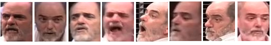  </details>  |  <details><summary>view samples from track </summary>  </details>  |  <details><summary>view samples from track </summary>  </details>    |
   |  <details><summary>view samples from track </summary>  </details>   |  <details><summary>view samples from track </summary>  </details>     |  <details><summary>view samples from track </summary>  </details>  |
   |  <details><summary>view samples from track </summary>  </details>    |  <details><summary>view samples from track </summary>  </details>   |  <details><summary>view samples from track </summary>  </details>     |
</details>

#### nyc, find the output file [here][3]
##### Identities in nyc video
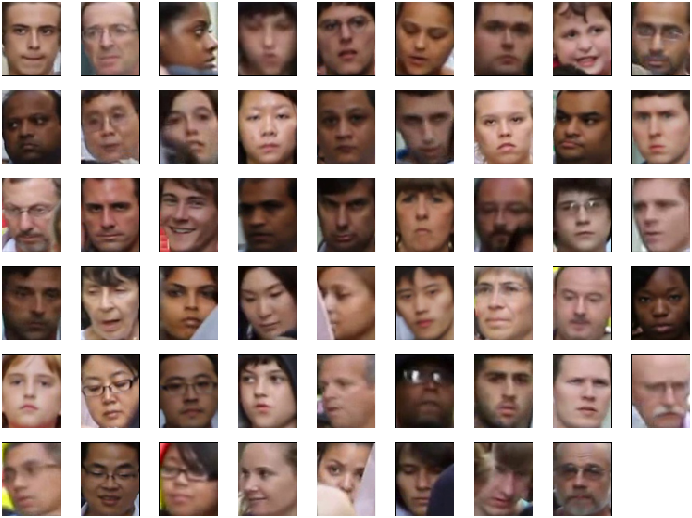 
<details>
  <summary>Click here to view the face tracks from annotated nyc</summary>
   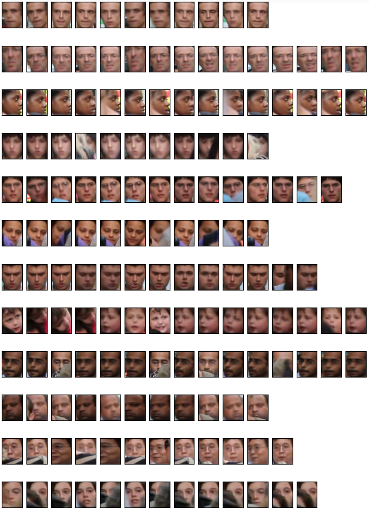 
   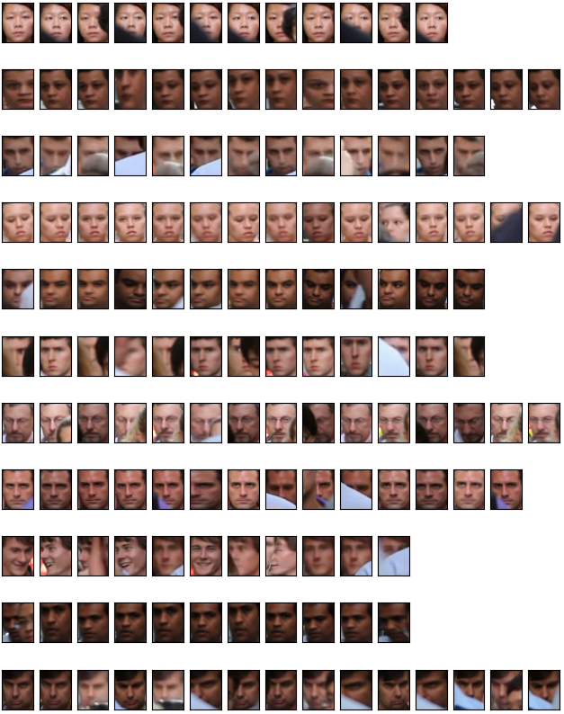 
   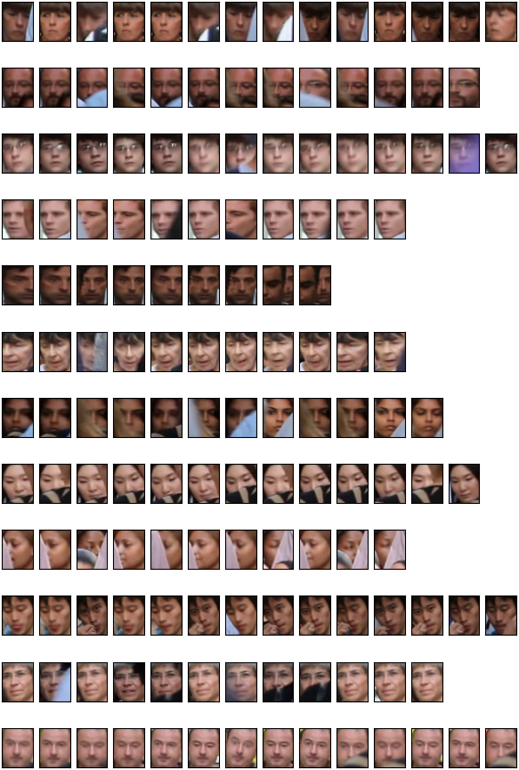 
   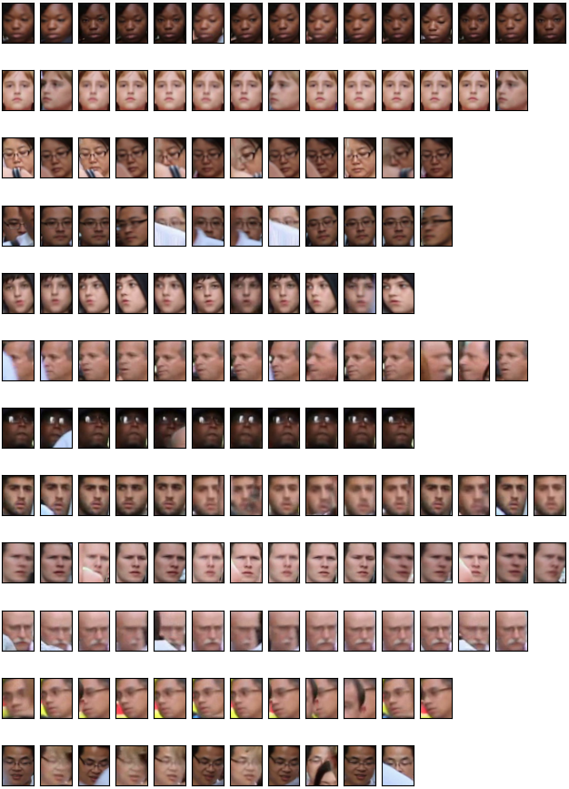 
   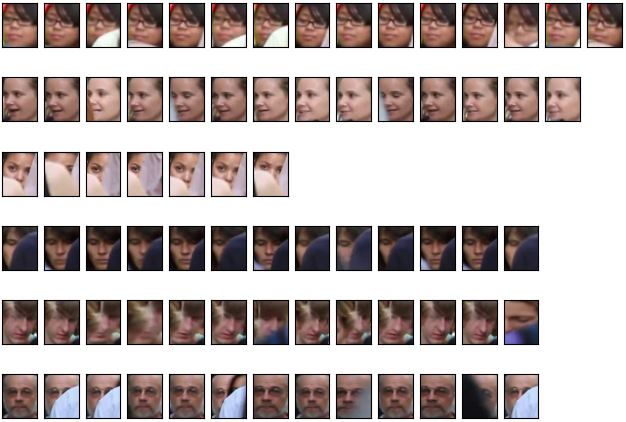 
 
   [Go to Top][4]
 </details>

 #### bengaluru, find the output file [here][5]
##### Identities in bengaluru video
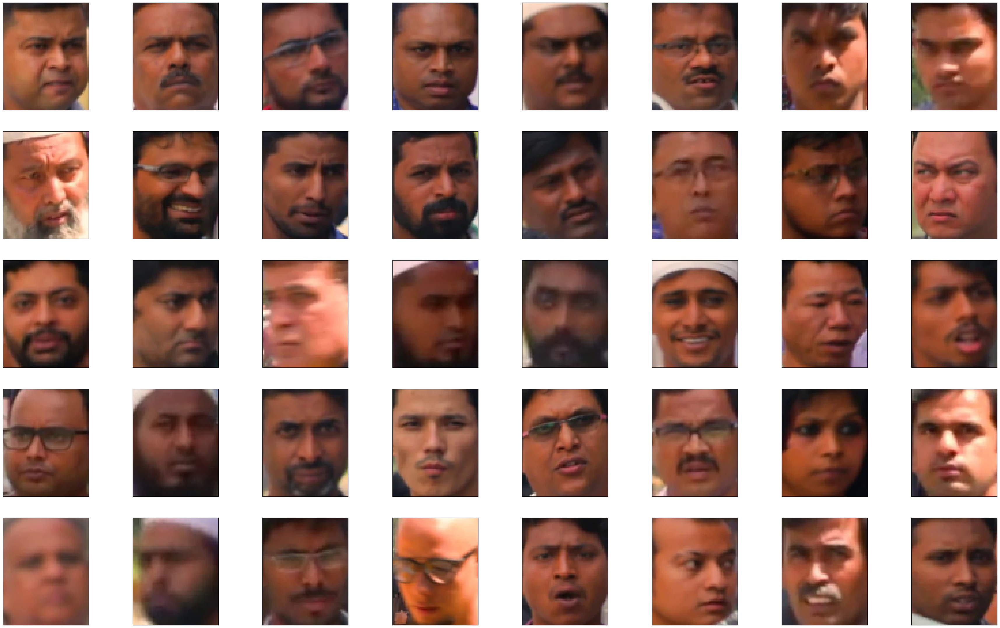 
<details>
  <summary>Click here to view the face tracks from annotated nyc</summary>
   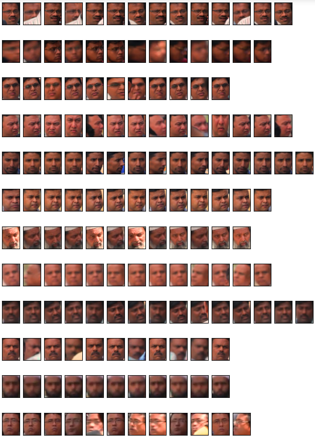 
   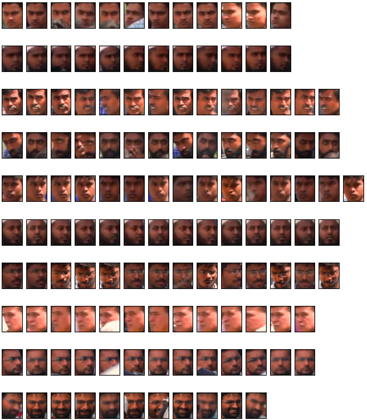 
   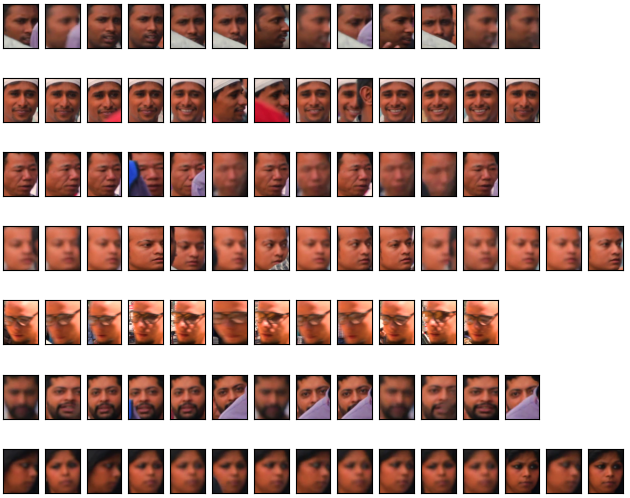 
   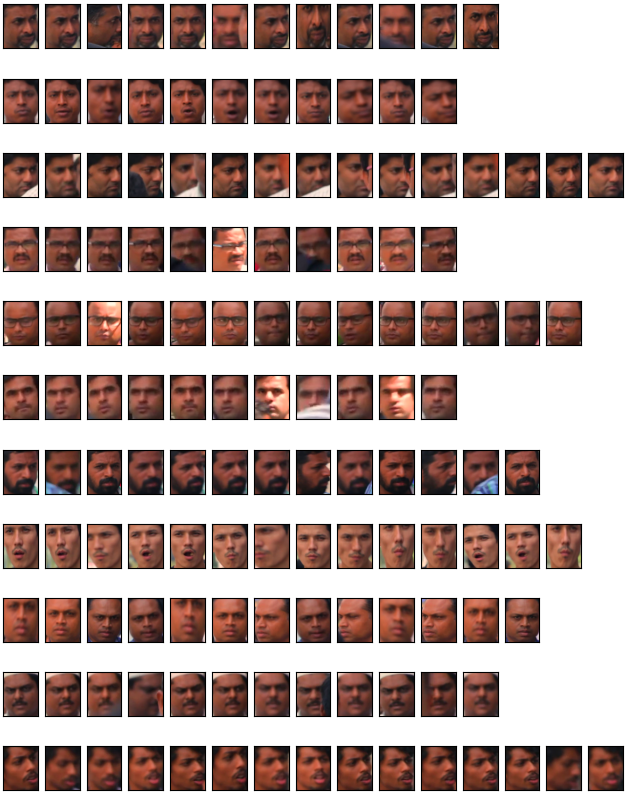 
 
   [Go to Top][6]
 </details>
 
[1]: https://pypi.org/project/retinaface-pytorch/
[2]: https://www.youtube.com/watch?v=gszbhDlbv0E&list=PLVhDP9umWvqQA0YVloYnDTbUIVmG3YHnl&index=2&ab_channel=KiranChaitanya
[3]: nyc
[4]: #identities-in-nyc-video
[5]: bengaluru
[6]: #identities-in-bengaluru-video
